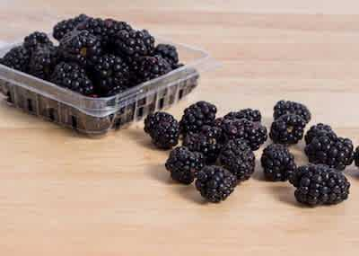

As both a Software Engineer and someone passionate about sustainability and reducing food waste, joining Imperfect one month ago was an easy decision for me.

I’m a Frontend Engineer working remotely from Philadelphia, and our Engineering team is spread out all across the US. We’re a cross-functional team working on both the Imperfect Produce shopping experience, as well as complex internal tools and interfaces. Throughout my interview process, some really important things stood out to me.

The team genuinely cares about Imperfect’s mission: reducing food waste. Now that I’m an employee, it’s clear that everyone here does too, not just my direct team. My co-workers share tips on how they personally help reduce food waste in their own homes, they teach information sessions about topics like Permaculture, and they’re actual customers of Imperfect Produce.

Everyone on the team cares about excelling in their area of expertise. We’re using an array of interesting technologies to create a complex e-commerce product, and the stack ranges from React and Redux, to Node and F#, with a lot in between.

Finally, they’re solving interesting problems, using an experiment and data-driven approach. How do we help our users find the products most interesting to them, while still recovering as much produce and imperfect dry goods as possible? How do we make our operations and fulfillment centers run more safely and efficiently? How do we run iterable experiments on our website in multiple markets, and when do we feel confident enough in their results to release to everyone or pull the plug?

Needless to say, all of this piqued my interest. Let’s fast forward a couple of weeks to my first day!

First impressions are important, and mine was that the team was extremely prepared for me to start -- always a good sign! My calendar was booked with onboarding sessions and introductory 1-on-1 chats with everyone on my team for the first week. I was provided with an overview of what my first week would look like, which contained polished documentation, links to our repositories, tools, business acronyms (ask me about ATP, PLE, FC!), and information on how to gain access to everything.

On the morning of my first day, one of my new teammates welcomed me on a video call. She showed me around some of our tools and workspaces, and made sure I was in all the right Slack channels. Most importantly, she made it known that onboarding me was her priority. There was even a new slack channel with a subset of our team, dedicated to fielding my questions and being available to help. Everyone was extremely generous with their time and knowledge. As a remote team, these details really stood out to me as both a way to set me up for success, and to immediately integrate me into the team.

I started cloning repos, attending business and code overview sessions, and by the end of the week had written and deployed my first feature. Slowly but surely, I started picking up more challenging pieces of work.

One of the first things that struck me about the team was how intentional everything they did was. Yes, there’s a ton of room for creativity and flexibility, but it’s designed that way.

As a remote team, we’re mindful of having clear communication and fostering a sense of team. We do written slack standups, which allows everyone to post their updates when it makes the most sense for them.

Our weeks are structured in a way that encourages both collaborative ideation and longer windows of deep work. We have planning meetings on Monday, and retro meetings on Friday. Tuesday through Thursday are meant for digging into code. Occasionally throughout the week, we have some Clambakes.

Yes, you read that right. But no, it’s not what you think!

Shortly before I joined, the team was brainstorming ways to foster more collaboration and knowledge-sharing across work. They decided that in our planning meetings, we would try self-assigning smaller groups of the team to each project on our Asana Board. That self-assigned group for a given project might consist of a Frontend Engineer, Backend Engineer, QA Engineer, and our Product Manager.

That group is called a ‘Clamshell’, and they might have a follow-up conversation or two to dig into and finalize the project’s requirements. That follow-up conversation is called a ‘Clambake’. So there you go - Clamshells (a smaller group of team members) have Clambakes (follow-up brainstorming and planning sessions).

> Clamshell

> Clambake

Every other week, we have one day dedicated to working on anything interesting to us about the business, product, or technology -- this is called Zen10. It’s been really helpful having this dedicated day to explore anything I’m interested in, and then demo some of my proposed features in our Friday Retro/Demo. So far I’ve used it to brush up on technologies here I was unfamiliar with, code a proof-of-concept new feature with an interesting endpoint, and even write this blog post!

Our retros on Fridays also function as a dedicated space to hang out together for an hour or so. We demo what we worked on during the week, share any important team updates, and chat about what’s going well or not-so-well. This is my favorite hour of the week by far -- It’s great being able to celebrate the progress from the week together, see the results of our work, and start winding down for the weekend.

As a new user of the product itself, I feel lucky to be in a position to work directly with the team building it. It’s energizing being able to both voice my first impressions and actually investigate new, useful features that as a customer, I’d love to see.

I’m looking forward to digging deeper into our challenges, and making a positive impact on the food system through technology.

We're hiring for lots of positions, especially on the Engineering and Product side. If you're interested in learning more, [apply here](https://jobs.lever.co/imperfectproduce?team=Engineering)!
